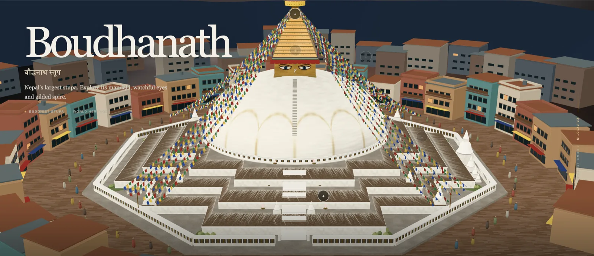

For months my default has been Claude, to the point of muscle memory. So much so that I wrote a [post about the Claude Code features I only found by using it every day](/blog/claude-code-daily-features.html). When your tool already works, switching is usually a bad trade.

Then OpenAI shipped GPT-6 Astra on September 3rd, with claims about it being their strongest software engineering model yet and running for hours at a stretch on long tasks. The noise got loud enough that ignoring it started to feel like a decision rather than an oversight.

Benchmarks are a weak signal for whether something is any good on a Wednesday night, though. So rather than test it on work I already know how to do, I picked a domain I know nothing about. My understanding of 3D graphics began and ended at having seen the file extension `.glb` somewhere.

So I asked it to build the Boudhanath stupa.

Two hours later I had [nepalin3d.com](https://nepalin3d.com), and I hadn't written a line of the code. Not the 2,700 lines of Python that drive Blender and generate the whole thing from scratch, not the textures, not the 2,004 individually modeled prayer flags.

## The part that surprised me

Not that it could write the code. I assumed that.

What I didn't expect was that it would hold up under real engineering pressure. The build uses fixed random seeds, so running it twice gives you the same stupa instead of a slightly different one. There's a validation step that exports the finished model, reads it back in, and checks that the eyes are on all four faces, that all six butter lamps still flicker, that all 2,004 flags survived the export, that no texture went missing. When I pushed on one part, it held the shape of the rest instead of forgetting what it had already built.

The sourcing was the same story. There's a file in the project listing every photograph consulted, what each one was used for, and where the model had to guess. It says plainly that the decorative printing on the flags is invented ornament rather than a transcription of sacred text, and that the surrounding neighborhood is an interpretation rather than a survey. Those are real distinctions when you're rendering somebody's living place of worship.

So am I switching? Possibly, which is more than I planned to say. Claude still feels better when I know exactly what I want, on code I have to maintain afterward. Astra was better in the mode where I couldn't even phrase the request properly yet.

But here's what I keep coming back to. The model knew Blender's API and I didn't. It did not know that the flags should be windblown rather than stiff, that the lamps matter more after dark, or that you owe a real place an honest note about what you made up.

Go [rotate a stupa](https://nepalin3d.com).
