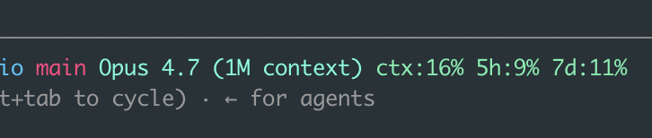
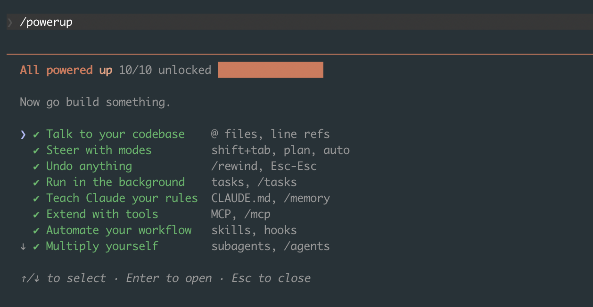

This is the fourth time I've written about Claude Code, which probably tells you something. I started with [the basics](/blog/post.html?post=claude-code-basics), then wrote up [the workflows that actually compound](/blog/post.html?post=claude-code-intermediate), then went through [the 15 hidden features from Boris Cherny's thread](/blog/post.html?post=claude-code-hidden-features). Those last ones I learned from someone else. The ones in this post I found the slow way, by using the tool every day and bumping into things.

That's the pattern I've settled into: I'm in Claude Code for hours a day, and every couple of weeks I trip over a feature that quietly removes some annoyance I'd stopped noticing. None of these are secret. Most are one keystroke or one command. But each one made a real dent in how fast I move, and I wish I'd found them sooner. So here they are.

## Rewind, not just interrupt

I knew about pressing Escape twice to stop Claude mid-task. What I didn't know for an embarrassingly long time is that double-tapping Escape also lets you *rewind*. It opens a list of earlier points in the conversation, and you can jump back to one, restoring both the conversation and the files Claude changed since then.

This changed how I experiment. Before, if Claude went down a bad path and edited six files, I'd either untangle it by hand or reach for git. Now I rewind to the checkpoint right before the bad idea and try a different prompt, as if the detour never happened. You can also run `/rewind` directly. Think of it as undo for the whole session, code included, not just the last message.

## Stop waiting. Queue your next instruction

For months I'd watch Claude work, wait for it to finish, then type my next message. Turns out you don't have to wait. While Claude is editing or running a command, you can type your next instruction and hit enter. It queues, and Claude picks it up the moment it's done with the current step.

This sounds minor. It isn't. My session is now a steady stream of "do this, then update the tests, then run the linter" where I type each part as it occurs to me instead of holding it in my head until Claude comes up for air. The waiting-around feeling mostly disappeared.

## Paste a screenshot instead of describing the bug

When something looks wrong in the browser, or a stack trace is buried in a screenshot a teammate sent me, I used to retype or describe it. Now I just paste the image straight into the prompt (or drag it in). Claude reads it.

For frontend work this is the one I reach for most. "Here's what it looks like, the spacing on the card is off, fix it" with a screenshot attached gets me a better result than any paragraph of description. Same for error dialogs, design mockups, and diagrams. If I can see it, I can hand it over instead of transcribing it.

## Press `#` to remember something on the spot

I covered CLAUDE.md in the earlier posts, but I'd always edit it as a separate chore. Then I learned you can start a message with `#` and whatever you type gets saved as a memory. Claude asks where to put it (the project file, your personal one) and files it away.

So now, the moment I notice myself explaining the same thing twice ("we never edit the generated files in `dist/`"), I type `# we never edit files in dist/, they're generated` and move on. The project's memory grows out of real moments instead of one big upfront writing session that I never get around to.

## If you don't have a CLAUDE.md yet, fix that first

Half the features here lean on Claude already knowing your project. If you've never set that up, two commands get you most of the way. `/init` scans your codebase and writes a starter CLAUDE.md, a short brief on what the project is and how to run it. It won't be perfect, but it beats a blank file. From there, `/memory` opens your memory files for editing, and the `#` shortcut from above grows them as you work.

I treated this as optional for far too long. It isn't. A session where Claude already knows your conventions is a completely different experience from one where you re-explain them every time. If you do only one setup step, do this one. I got into what belongs in a CLAUDE.md, and what doesn't, in [the basics](/blog/post.html?post=claude-code-basics) and [intermediate](/blog/post.html?post=claude-code-intermediate) posts.

## Shift+Tab has a mode past plan mode

The basics post mentions Shift+Tab toggles plan mode. What I missed is that Shift+Tab actually cycles through three states, not two: normal, auto-accept edits, and plan mode. Auto-accept is the one I'd overlooked, and it's the one I now use most.

In auto-accept mode, Claude applies its file edits without stopping to ask for each one. That sounds reckless, and it would be if I used it blindly. But for a well-scoped task on a branch I can throw away, paired with a clean git history, letting it run without confirming every edit is a different pace entirely. I plan first (plan mode), confirm the approach, then Shift+Tab over to auto-accept and let it execute. Read-only safety when I'm thinking, full speed when I've decided.

## Run the slow thing in the background

I used to start my dev server in another terminal tab, then describe to Claude what I saw. Now I have Claude run it in the background with Ctrl+B (or I just ask it to run the command in the background). The command keeps running, Claude keeps working, and it can read the server's logs whenever it needs to.

This is perfect for anything long-lived or slow: a dev server, a test watcher, a build. Claude starts it, moves on to writing code, and checks the output when it matters, instead of the whole session blocking on one command that never exits.

## `claude --continue` picks up exactly where you left off

I close my laptop mid-task more than I'd like to admit. For a while, the next morning meant re-explaining what I'd been doing. Then I found `claude --continue` (or `claude -c`), which drops you back into your most recent session in that folder with the full context intact. No re-explaining.

If it wasn't the most recent session, `claude --resume` (or `/resume` from inside Claude) gives you a picker of past sessions to jump back into. Between the two, "where was I" stopped being a question I had to answer manually.

## Ship it without leaving the conversation: the Vercel CLI

A lot of my loop used to have a context switch baked into it. Write the code in Claude Code, then jump to a separate terminal to deploy and check that it's live. For anything I host on Vercel, that switch is gone, because Claude Code can drive the Vercel CLI directly. I ask it to deploy and tail the logs, and it runs `vercel`, reads the build output, and tells me if something broke, all in the same session where I just made the change.

There's also a Vercel plugin that adds slash commands on top of this. The ones I reach for:

- `/vercel:deploy` ships the current project. It's a preview deploy by default; pass `prod` to push to production.
- `/vercel:status` shows recent deployments, the linked project, and the environment setup at a glance.
- `/vercel:env` manages environment variables: list, pull, add, remove, diff.

The point isn't that typing `vercel` is hard. It's that the gap between "the code is written" and "it's live and the build passed" used to span two windows and a few minutes of split attention. Now it's one continuous back-and-forth.

## A status line that watches your context for you

The default status line is fine. `/statusline` lets you replace it with something that actually earns its space, and it'll generate the script for you if you describe what you want. Mine packs in the model I'm on (Opus 4.7, with the 1M-token context window), how much of that context I've used, how close I am to my usage limits over the last 5 hours and 7 days, and the current git branch:

That context number is the one that changed my habits. The sneakiest performance killer in Claude Code is letting the context window fill up, which I got into at length in the [intermediate post](/blog/post.html?post=claude-code-intermediate). I used to find out I was running low only when I went looking for it with a command. Now it sits in front of me the whole time, so I clear or compact *before* the responses start getting vague, not after. It turned context management from something I had to remember into something I just see.

## Hand off instead of compacting, and set a `/goal`

When a session gets long and context runs low, the obvious move is `/compact`, which summarizes everything so far and keeps going. I've mostly stopped reaching for it first. A compacted session is still the same tired session, now running on a lossy summary of itself. More often I'd rather hand the work to a fresh context: write a two-line note of what's done and what's left, start clean, and point the new session at it. Subagents are the built-in version of this idea: you delegate a scoped chunk to an agent with its own context window, so the main session stays clean. I got into that in [the intermediate post](/blog/post.html?post=claude-code-intermediate).

The newer piece that makes this click is `/goal`. You hand the session a success condition, like `/goal all tests pass`, and Claude keeps working toward it instead of stopping after one turn. The goal even survives a resume, so if you come back tomorrow with `claude --continue`, it picks the target back up. `/goal clear` ends it early (and it only runs in a trusted workspace, so accept the trust prompt first). Paired with a clean handoff, I get to define what "done" looks like once and let the session drive toward it, instead of nudging it forward turn by turn.

## The newest one: `/fast`

This is the most recent thing I've turned on. `/fast` toggles fast mode, which runs Claude Opus with noticeably quicker output. It's not a smaller, dumber model trading quality for speed. It's the same Opus, just faster, available on the recent Opus versions.

For the back-and-forth parts of my day, small edits, quick questions, iterating on a function, the lower latency adds up to a meaningfully snappier session. I leave it on for most things and only think about it when I'm doing something that genuinely needs maximum deliberation.

## A few smaller ones

Not everything deserves its own section. A handful I've started using that are worth a single line:

- `/output-style` changes how Claude responds. I flip to the explanatory style when I want it to teach me as it works, not just hand me code.
- `/doctor` diagnoses a broken or sluggish setup. The first thing I run when something feels off before I start blaming the model.

## The one that maps the whole tool: `/powerup`

I'll end on the feature that, in a way, contains all the others. `/powerup` opens a checklist of Claude Code's ten core capabilities and tracks which ones you've actually used, with a short lesson behind each row. Here's mine, fully unlocked:

What I like is that it's organized by what you're trying to do, not by command name:

- **Talk to your codebase** with `@` files and line refs
- **Steer with modes** using shift+tab, plan, and auto
- **Undo anything** with `/rewind` and Esc-Esc
- **Run in the background** with tasks and `/tasks`
- **Teach Claude your rules** through CLAUDE.md and `/memory`
- **Extend with tools** via MCP and `/mcp`
- **Automate your workflow** with skills and hooks
- **Multiply yourself** with subagents and `/agents`
- **Code from anywhere** with `/remote-control` and `/teleport`
- **Dial the model** with `/model` and `/effort`

Arrow keys to move, Enter to open a row and learn it. If you're new to Claude Code, running `/powerup` early is a faster map of the tool than reading the docs end to end. And if you've followed these four posts, you'll notice it's basically their table of contents on a single screen.

Most of these aren't headline features. There's no autonomous agent fleet here running while I sleep, the heavier automation lives in [the intermediate post](/blog/post.html?post=claude-code-intermediate) and the [hidden features](/blog/post.html?post=claude-code-hidden-features) writeup. They're the small, daily frictions I'd quietly accepted until I found the thing that removed each one. That's the real lesson across four posts now: the tool keeps getting better, but a lot of the gain was already sitting there, one keystroke away, waiting for me to notice. I'll keep using it daily, and I'll keep finding more. When I do, there'll be a fifth post.
