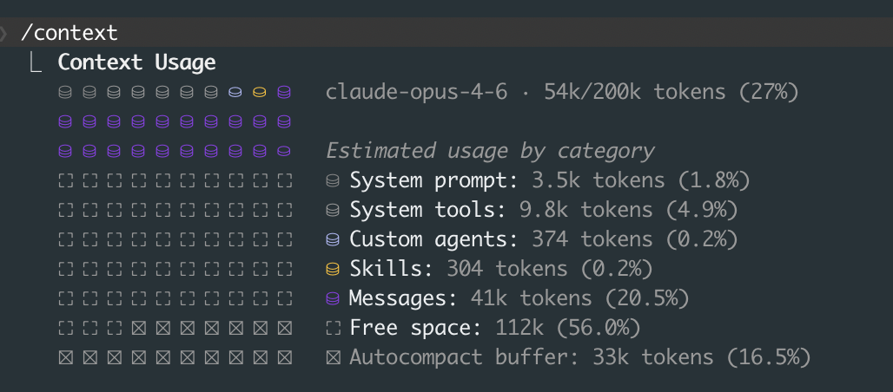

There's a particular kind of frustration that comes from watching your Claude Code session slow to a crawl, burning through tokens while you sit there waiting for it to come back with something useful. You paste in a few more files, ask a follow-up, and the response gets worse. Then worse again. Most people hit this wall and blame the model. But the model isn't the problem. The way you feed it context is.

This post is for people who already use Claude Code daily and want to get meaningfully better at it. If you're brand new to Claude Code, start with [the basics post](/blog/post.html?post=claude-code-basics) first. This isn't tips-and-tricks stuff. These are the structural changes that compound over weeks.

---

## Context Is Infrastructure

Anthropic's engineering blog puts it well: context isn't just "what Claude knows," it's the entire operating environment. System prompts, file contents, conversation history, tool outputs. All of it competes for the same finite window. When that window fills up, performance degrades in ways that are hard to diagnose. Responses get vague. Instructions get forgotten. You start blaming the model when really you've just drowned it in tokens.

The `/context` command shows your current token usage. Here's what it looks like mid-session:



At 27% this session is healthy. But notice how messages alone eat 20%. A few more large file reads and you're at 60%, then 80%, and suddenly Claude starts forgetting your earlier instructions. The autocompact buffer is your safety net (Claude will summarize old context when it runs low), but you don't want to rely on it. By the time autocompact kicks in, you've already lost nuance.

Check this often. I check it like I check disk space on a server.

When context gets heavy, you have two good options:

**The /clear + /catchup pattern.** Just clear the context and let Claude re-orient by reading your codebase fresh. This works surprisingly well for ongoing work in a single repo.

**The "Document & Clear" workflow.** Before clearing, ask Claude to dump its current progress, decisions made, and open questions into a markdown file. Then `/clear`, and start a new session by pointing Claude at that file. You lose nothing and get a fresh context window. I keep a `scratch/` folder for these handoff docs.

Both patterns feel wasteful at first. They're not. A fresh 20% context window with good instructions will outperform a bloated 90% window every time.

---

## CLAUDE.md: Less Is More

Your CLAUDE.md file is the highest-priority context Claude reads on every interaction. Most people treat it like a junk drawer. Don't.

HumanLayer's advice here is solid: keep your root CLAUDE.md under 60 lines. If you need more (and you probably do for a real project), use progressive disclosure. Create an `agent_docs/` folder with separate files:

```
CLAUDE.md                    # Core project identity, key conventions
agent_docs/
  build.md                   # Build system, dependencies, env setup
  testing.md                 # Test patterns, how to run tests
  conventions.md             # Code style, naming, architecture decisions
  api-patterns.md            # How we structure API endpoints
```

The key insight: in your root CLAUDE.md, pitch Claude on *why* to read each file. Don't just list paths.

```markdown
# Project: Acme API

TypeScript + Express + Prisma. Monorepo with packages/api and packages/web.

## Before making changes:
- Read agent_docs/conventions.md for our naming and error handling patterns
  (we do things differently than most Express apps)
- Read agent_docs/testing.md before writing any test
  (we use a custom test harness, not raw Jest)
```

**Anti-patterns I see constantly:**

- Using CLAUDE.md as a linter. If you want consistent formatting, set up Prettier and a pre-commit hook. Don't ask Claude to remember "always use single quotes."
- Auto-generating CLAUDE.md from your codebase. These files are always too long and too generic. Write it by hand.
- Adding task-specific instructions. CLAUDE.md is for project-level context. If you need task-specific guidance, put it in your prompt.

---

## Subagents and Parallel Work

This is where things get interesting. Instead of one Claude session trying to do everything (and burning through context doing it), you can spawn multiple agents that work in parallel.

The pattern, as described in the claude-code-ultimate-guide, looks like this: a lead agent coordinates the work, breaks it into subtasks, and assigns each to a subagent. Each subagent gets its own context window, so instead of one agent at 85% context usage, you have three agents each at 35%.

In practice, I use this for things like: "refactor the auth module" gets broken into (1) update the middleware, (2) update the tests, (3) update the API routes. Each subagent works independently, the lead agent merges the results.

The mental model is a senior engineer delegating to juniors. You wouldn't hand one junior the entire codebase and say "fix everything." You'd scope the work, assign pieces, and review the output.

---

## Custom Slash Commands and Hooks

If you find yourself typing the same instructions repeatedly, make a slash command. Create files in `.claude/commands/`:

```markdown
# .claude/commands/review.md
Review the current git diff for:
1. Logic errors or edge cases
2. Missing error handling
3. Security issues (SQL injection, XSS, auth bypasses)
4. Performance problems (N+1 queries, unnecessary re-renders)

Be specific. Reference line numbers. Don't summarize what the code does.
```

Now `/review` runs that exact prompt every time. I have commands for `/test-plan`, `/pr-description`, and `/debug` that save me minutes per session.

**Hooks** are even more powerful. These run automatically before or after Claude takes actions. As Shrivu Shankar notes in his breakdown, the right way to think about hooks is as "block-at-submit" validators, not mid-write blockers. You want hooks that catch problems at commit time or after file writes, not hooks that interrupt Claude's flow while it's working.

Practical examples:

```json
{
  "hooks": {
    "PostEditFile": [
      { "command": "prettier --write $FILE" }
    ],
    "PreCommit": [
      { "command": "npm run lint" },
      { "command": "npm run typecheck" }
    ]
  }
}
```

Auto-format after every file edit. Lint before every commit. Claude never has to think about formatting, and you never get a commit that breaks CI.

---

## MCP: Connecting Claude to Everything

Model Context Protocol lets you connect Claude Code to external data sources: Google Drive, Jira, Slack, databases, custom APIs. Think of MCP servers as data gateways that provide high-level tools, not raw API mirrors.

The distinction matters. A bad MCP server exposes `GET /api/issues?status=open&assignee=me&project=ACME`. A good one exposes a tool called `get_my_open_issues` that handles the API details internally. Claude doesn't need to know your Jira query syntax. It needs to know what questions it can ask.

MCP is most valuable when your workflow involves cross-referencing information across systems. "Look at the Jira ticket, check the related Slack thread, then implement the feature." That's a workflow that used to require you to manually copy context between tabs. With MCP, Claude pulls it directly.

---

## Skills: Packaged Expertise

Skills are custom onboarding materials you can create and share. Think of them as reusable instruction sets that go beyond what CLAUDE.md covers. You can package up project-specific knowledge, workflow patterns, or domain expertise into a skill that Claude loads on demand.

As Shrivu Shankar notes, skills might be a bigger deal than MCP in the long run. MCP gives Claude access to data. Skills give Claude access to *judgment*, how to approach problems in a specific domain, what patterns to follow, what mistakes to avoid.

Creating a skill is simple enough: you define the instructions, specify when they should activate, and Claude loads them as needed. The key is encoding the "why" alongside the "how." Don't just tell Claude what to do. Tell it why your team does it that way.

---

## GitHub Actions: Claude in CI

Running Claude Code in CI is production-ready now. The `/install-github-app` command sets up automated PR review. Every pull request gets analyzed for bugs, style violations, and architectural concerns. Full audit logs track what Claude suggested and what got merged.

The CI integration works best when you pair it with a good CLAUDE.md. Claude reviewing PRs uses the same project context as Claude writing code. If your CLAUDE.md clearly states "we never use ORM magic for database migrations, always write raw SQL," then PR reviews will flag ORM-based migrations.

This closes the loop between writing code and reviewing it with the same set of project conventions.

---

## Power-User Commands Worth Knowing

A few commands that don't get enough attention:

- **`/diff`**: Opens an interactive diff viewer showing all uncommitted changes, plus per-turn diffs so you can see exactly what Claude changed at each step. Much better than scrolling through terminal output.
- **`/review`**: Reviews a pull request for code quality, correctness, and security. You can point it at any PR, not just your own.
- **`/compact [instructions]`**: Most people use `/compact` without arguments. But you can pass custom instructions like `/compact preserve the full list of modified files and any test commands`. This controls what survives compaction.
- **`/fork`**: Creates a branch of your conversation at the current point. Useful when you want to try two different approaches without losing your current context.
- **`/model`**: Switch models mid-session. Start with a faster model for exploration, then switch to Opus for the tricky implementation work.
- **`Alt+T`** (macOS: `Option+T`): Toggles extended thinking on and off. Turn it on for complex architectural decisions, turn it off for quick edits. The token cost difference is significant.
- **`Ctrl+F`**: Kills all background agents. Press twice within 3 seconds to confirm. Your emergency brake when you've spawned too many parallel agents.
- **`/vim`**: Enables Vim keybindings in the input editor. Full support for motions, text objects, visual mode. If you're a Vim user, this makes the editing experience dramatically better.

For automation and CI, two CLI flags are worth knowing:

```bash
# Cap spending on a single run
claude -p "refactor the auth module" --max-budget-usd 5.00

# Limit how many agentic turns Claude can take
claude -p "fix failing tests" --max-turns 20

# Run in an isolated git worktree (no risk to your working tree)
claude --worktree "implement the caching layer"
```

The `--worktree` flag is particularly useful. It creates a temporary copy of your repo so Claude can make changes without touching your working directory. If the result is good, you merge it. If not, you throw it away.

---

## The "Shoot and Forget" Philosophy

Here's the mindset shift that changed how I work with Claude Code: stop watching it work.

Judge by the final PR. Did the code work? Did the tests pass? Was the implementation clean? If yes, it doesn't matter that Claude took a weird path to get there, or that it refactored a file you didn't ask it to touch, or that it wrote the tests before the implementation.

The tools are good enough now that the differentiator isn't "can Claude write this code." It can. The differentiator is everything around the code: how you structure your context, how you break down tasks, how you set up your project so Claude can be effective without constant hand-holding.

Internal workflow optimization is the real game. The developers I see getting the most out of Claude Code aren't the ones who write better prompts. They're the ones who build better infrastructure around their prompts: clean CLAUDE.md files, modular agent docs, custom commands, hooks that enforce standards automatically.

The best prompt is the one you never have to write because your setup already handles it.
