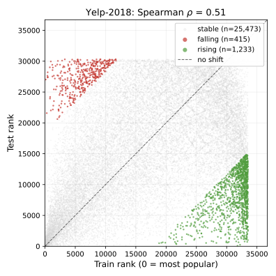
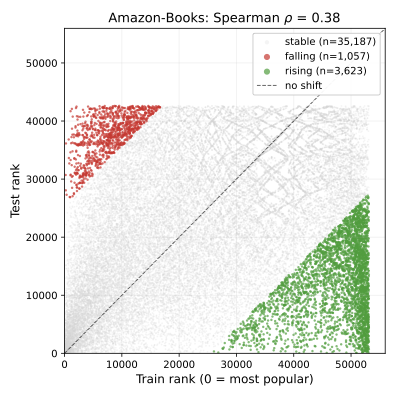
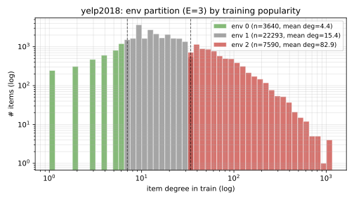
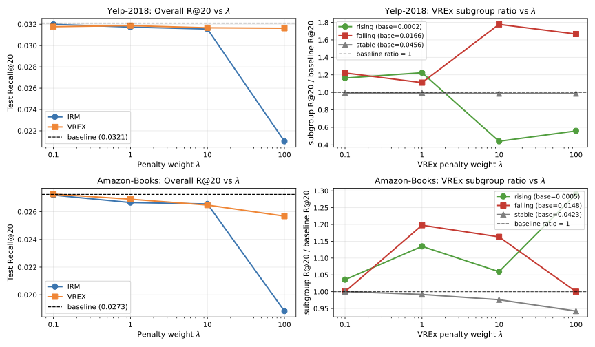
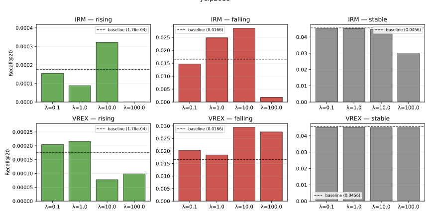
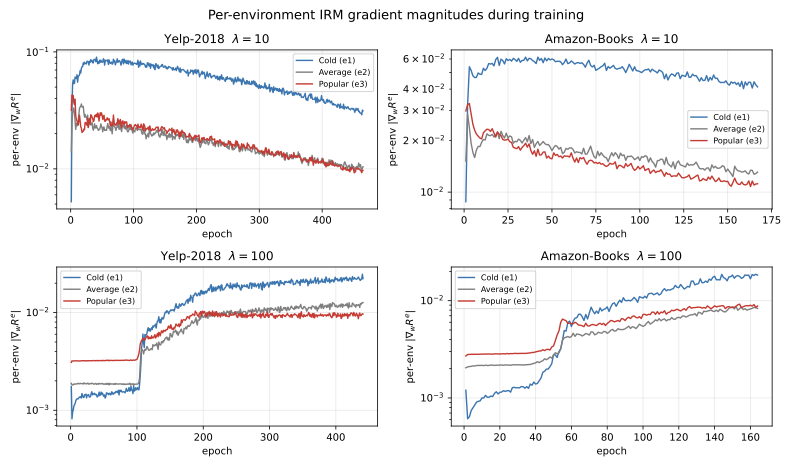

Imagine a Labubu doll sitting in an online store's catalog. For two years it sells a few units a month, mostly to a tight community of collectors. A recommender system trained on that window learns almost nothing about it: its embedding is noisy, its neighborhood is small, it barely shows up in anyone's top-20. Then overnight it goes viral on TikTok. Demand explodes. By any reasonable measure, the store should be recommending it constantly. The model keeps ignoring it.

Now flip the scenario. A Labubu variant that was a breakout hit last year is quietly going out of fashion. The training graph has thousands of edges pointing at it; its embedding is confident; it scores high for almost every user. The model keeps recommending it long after nobody wants it anymore.

This is what popularity shift does to graph recommenders. Items whose popularity rose at test time are invisible; items whose popularity fell are pushed at everyone. The model is a snapshot of a world that no longer exists, and because it's a GNN, the snapshot is baked into embeddings that took layers of message passing to form. You can't just fix this by bolting on a bias term.

The other thing worth knowing up front: every LightGCN number you've read in a paper is measured on a random 80/10/10 split. Take the same code, same hyperparameters, same seed, and split the data chronologically instead (train on the past, test on the future, like any sane production system), and Recall@20 on Yelp-2018 drops from 0.0599 to 0.0321. That's a 46% drop on the same model. Amazon-Books drops 30%. The popularity-shift problem in graph recommenders is the kind of thing the literature carefully splits around. Once you respect time in your evaluation, the headline number for the standard GNN recommender collapses.

This is a writeup of a [project I did this semester at Purdue](/experience/) (CS 587). We started from that reproduction, framed popularity shift as a distribution-shift problem on graphs, and tried to fix it with two techniques from the out-of-distribution generalization literature: Invariant Risk Minimization (IRM) and Variance Risk Extrapolation (VREx). One of them worked cleanly. The other collapsed at high regularization strength in a way I found more interesting than the fix itself.

## The problem

LightGCN is the standard GNN backbone for recommendation. It takes the bipartite user-item interaction graph, passes messages along edges for a few rounds, and scores a candidate item for a user with the dot product of their final embeddings. It's minimal on purpose: no feature transformations, no nonlinearities between layers, just smoothing over the graph. This makes it fast and reproducible. It also makes it brutally dependent on the training graph's structure.

Here's the structural pathology. An item with 500 training interactions accumulates a stable embedding through repeated averaging with all its users. An item with 5 interactions gets a noisy embedding from a tiny neighborhood. Fine, that's expected. The problem is what happens when popularity changes over time.

If I train on 2017 Yelp interactions and test on 2018 interactions, some items that were obscure in 2017 explode in popularity in 2018. The model has barely learned anything about them. Meanwhile, items that were popular in 2017 are less relevant in 2018, but the model keeps recommending them because their embeddings are the most confident things it has. This is the phenomenon: the model recommends yesterday's popular items.

In distribution-shift language: the labelling mechanism (what users actually like) is stable, but the conditioning graph the model uses has changed. Item degrees shift. Neighborhood structure changes. The GNN sees a different world at test time than the one it trained on.

This isn't a surprise in general (covariate shift is a classic problem, [I wrote about it for production ML systems](/blog/post.html?post=ml-systems-production)), but GNN recommenders get hit harder because the shift propagates through message passing. A degree shift on item $i$ changes the messages every neighbor of $i$ sends in the next layer. One perturbation ripples outward.

The shift is easiest to see as a scatter plot of train rank vs. test rank for items that appear in both windows:





Points above the diagonal are Rising items (low train rank, high test rank); points below are Falling. Yelp's cloud hugs the diagonal, which says rankings shift but not violently. Amazon's cloud is diffuse: popularity gets shuffled across years. The Spearman $\rho$ between train and test ranks is 0.52 on Yelp and 0.39 on Amazon. These are the graphs the model is being asked to generalize across, and the shape of the cloud is what any fix has to handle.

## Why we didn't just fix it with a better backbone

Before getting to invariant learning, the honest question: why not just use a different architecture? Attention-based recommenders, debiased two-tower models, causal approaches. There's a whole zoo.

We kept LightGCN intentionally. The point of the experiment was to isolate whether a loss-level intervention could mitigate a structural shift. If you also swap the architecture, you can't tell which change did the work. The backbone stays fixed. Everything we do is in the loss.

If you're wondering whether a GNN is even the right tool here, I've written separately about [when to reach for a GNN at all](/blog/post.html?post=should-you-use-a-gnn). Recommendation on bipartite interaction graphs is one of the cases where they genuinely earn their keep: the structure is dense, homophilous, and the task is fundamentally relational.

## The framing: items as environments

The IRM/VREx framework (Arjovsky et al. 2019, Krueger et al. 2021) says roughly: if you have training data from multiple environments, force your predictor to be simultaneously optimal on all of them. That pushes the model toward features that are stable across environments and away from spurious ones that only work in some.

To use this, you need environments. In image classification the environments are usually different domains (photos vs. sketches, different hospitals, different cameras). We don't have that. We have one interaction graph.

The move is to make environments up from the graph's structure. Split items into popularity buckets by training-time degree percentile. With three buckets, that's "popular" (top 20% of items), "average" (middle 60%), and "cold" (bottom 20%). Each training triplet $(u, i, j)$ of user, positive item, negative item is assigned to the environment of its positive item.

```python
def build_environments(train_edges, n_items, n_envs=3):
    # Count training interactions per item
    item_degree = torch.zeros(n_items)
    for (_, i) in train_edges:
        item_degree[i] += 1

    # Percentile cutoffs: 20% and 80% for E=3 (cold, average, popular)
    cutoffs = torch.quantile(item_degree, torch.tensor([0.2, 0.8]))
    env_of_item = torch.bucketize(item_degree, cutoffs)  # 0=cold, 1=avg, 2=popular
    return env_of_item  # shape: [n_items]

def env_of_triplet(triplet, env_of_item):
    # Each (u, i, j) triplet gets the environment of its positive item i
    _, pos, _ = triplet
    return env_of_item[pos]
```

That gives three environments that correspond to the axis along which the distribution actually shifts: popularity. If a training-popular item becomes less relevant at test time, the shift happens within the popular environment. If a training-cold item explodes, the shift is felt by the cold environment. Forcing a single predictor to be optimal across all three buckets at train time is the asymptotic analog of forcing it to be robust to popularity moving at test time.



## IRM and VREx, briefly

Both losses add a penalty on top of the base Bayesian Personalized Ranking (BPR) loss:

$$\min_{\phi, w} \sum_e R^e(\phi, w) + \lambda \cdot \Omega(\phi, w)$$

where $R^e$ is the BPR risk inside environment $e$, $\phi$ is the LightGCN encoder, $w$ is the dot-product predictor, and $\Omega$ is the invariance penalty.

**IRM** attaches a dummy scalar $w' = 1$ in front of the predictor and penalizes the squared gradient of each per-environment loss with respect to $w'$:

$$\Omega_{\text{IRM}} = \sum_e \left\| \nabla_{w'} R^e(\phi, w' \cdot w) \Big|_{w'=1} \right\|^2$$

The penalty is zero when $w$ is already optimal within every environment, meaning the gradient wouldn't want to move in any direction.

```python
def irm_penalty(per_env_losses, model):
    # Attach dummy w' = 1 in front of the predictor and take the gradient
    # of each per-env loss. The penalty is the sum of squared grad norms.
    w_prime = torch.ones(1, requires_grad=True, device=DEVICE)
    penalty = 0.0
    for loss_e in per_env_losses:
        scaled = loss_e * w_prime  # w' factors through the BPR logit linearly
        grad = torch.autograd.grad(scaled, w_prime, create_graph=True)[0]
        penalty = penalty + (grad ** 2).sum()
    return penalty
```

**VREx** skips the gradient and penalizes the variance of the per-environment risks directly:

$$\Omega_{\text{VREx}} = \text{Var}(\{R^e(\phi, w)\}_e)$$

Zero variance means all environments have the same loss. Simpler to implement, and (as we'll see) better behaved.

```python
def vrex_penalty(per_env_losses):
    # per_env_losses: list of E scalar tensors (one BPR mean per environment)
    losses = torch.stack(per_env_losses)
    return losses.var(unbiased=False)
```

$\lambda$ trades ranking quality against invariance. $\lambda = 0$ recovers LightGCN. Large $\lambda$ forces invariance hard at the cost of fit.

The training loop is then just LightGCN with per-environment losses stacked up before the penalty:

```python
def training_step(model, triplets, env_of_item, lam, penalty_fn):
    u, pos, neg = triplets  # each shape [B]
    e_u, e_pos, e_neg = model.encode(u, pos, neg)  # LightGCN forward
    logits = (e_u * e_pos).sum(-1) - (e_u * e_neg).sum(-1)
    per_example_loss = -F.logsigmoid(logits)  # BPR loss per triplet

    env_ids = env_of_item[pos]
    per_env_losses = [
        per_example_loss[env_ids == e].mean() for e in range(N_ENVS)
    ]

    base = per_example_loss.mean()            # vanilla BPR
    penalty = penalty_fn(per_env_losses, model)
    return base + lam * penalty
```

## What actually happened

We ran 40+ model configurations: $\lambda \in \{0.1, 1, 10, 100\}$, environments $E \in \{3, 5\}$, layers $L \in \{1, 2, 3, 4\}$, and two BPR aggregation strategies, on both Yelp-2018 and Amazon-Books. All on temporal splits.

The main result: VREx works, IRM collapses at high $\lambda$.

To measure this carefully, we partitioned test items by how much their popularity rank changed between train and test. Items whose rank rose (they became more popular) form the **Rising** group. Items whose rank fell are **Falling**. The middle 60% is **Stable**. Subgroup recall tells you where any improvement is actually coming from.

On Yelp at $\lambda = 10$, VREx lifted Falling Recall@20 from 0.0166 to 0.0295, a 77% improvement, at only 1.2% cost on overall Recall@20. On Amazon, VREx at $\lambda = 1$ improved Falling by 20% at 1.5% overall cost. Stable recall stayed within noise. These are the numbers the project was designed to produce, and they landed.



The left panel is the headline: VREx holds overall Recall@20 flat (within 2% of baseline) up through $\lambda = 100$ on Yelp. IRM does not. The right panel is where the real story lives: the Falling subgroup ratio jumps to 1.77x at $\lambda = 10$, which is all the win.



Falling is the group I'd most expect to improve. These are items that were popular during training but less so at test time. The baseline over-predicts them (their embeddings are confident, they show up everywhere). Variance regularization forces the encoder to not lean so hard on popularity as a feature, which pulls down the spuriously-high scores for Falling items and lets the genuinely-relevant ones surface.

Rising is a different story. Those items hovered around Recall@20 = $10^{-4}$ across every configuration. Invariant learning doesn't help, nothing else did either. The brutal truth is that the training signal for these items is a handful of early interactions. No loss trick invents information that isn't there. Fixing Rising would need side information (item features, text descriptions) or a shorter, denser time window that keeps more of them in the training set.

## The IRM collapse

This is the part I want to spend time on, because it wasn't in the project proposal and it's the most useful takeaway.

IRM at $\lambda = 100$ catastrophically degraded both datasets: Yelp's overall Recall@20 dropped from 0.0321 to 0.0210, Amazon's from 0.0273 to 0.0188. VREx at the same $\lambda$ barely moved. We wanted to know why.

We instrumented the trainer to log per-environment gradient magnitudes and per-environment BPR risks every epoch.



Three things showed up:

First, at safe $\lambda = 10$, gradient magnitudes stayed around $10^{-2}$ on both datasets. The cross-environment coefficient of variation grew to about 0.6. IRM tolerates meaningful gradient heterogeneity at this regularization strength. The penalty nudges but doesn't dominate.

Second, at $\lambda = 100$, the cold-environment BPR risk stalled at exactly $\log 2 \approx 0.69$. That number is the loss of a constant predictor (sigmoid(0) = 0.5, -log(0.5) = log 2). The model is literally refusing to rank cold items. IRM, pushed hard enough, achieves invariance by destroying the cold-item ranking signal entirely. Pop quiz: the easiest way to make a predictor equally good across three environments is to make it equally bad across all three. That's what's happening.

Third, Amazon sat closer to this collapse cliff than Yelp even at $\lambda = 10$. Its cold-environment BPR was about $0.15$, more than twice Yelp's $0.07$. Amazon's tail is sparser and its cold items are intrinsically noisier, so smaller pushes on $\lambda$ tip it over. This matches the numbers in the lambda sweep: IRM on Amazon barely beats baseline even at safe $\lambda$, and falls off a cliff past that.

The asymmetry between IRM and VREx makes sense when you look at the penalty math. VREx's penalty is the variance of three scalars, each bounded by the per-environment loss scale. IRM's gradient-squared-norm penalty has no such envelope: it can blow up arbitrarily as you push $\lambda$. VREx degrades gracefully. IRM doesn't.

For practitioners thinking about applying IRM to recommendation: don't just pick $\lambda$ by cross-validated overall recall. The model can look healthy overall while silently destroying the predictor on your long tail, which is exactly the population you invoked invariant learning to help. Monitor per-environment loss during training. If the cold-bucket loss is pinned at $\log 2$ (or its analog for your loss function), you're in collapse territory.

## The stuff that surprised me

A few smaller findings that I didn't expect:

**Vanilla BPR beats environment-balanced BPR as a foundation.** We tried two aggregation strategies: sum losses across environments equally, or compute one mean over all triplets (vanilla). Balanced sounds principled (each bucket contributes equally), but it actively reduced the gain from the invariant penalty. On Yelp, the invariant Falling gain shrank from 77% with vanilla BPR to 10% with balanced. The read: vanilla BPR builds a stable, accurate ranking dominated by the large Stable environment, and the invariant penalty surgically corrects popularity-shift bias on top. Pre-balancing competes with the penalty by already disturbing the gradient weight on the noisier subgroups.

**Depth partially substitutes for invariance.** Sweeping GNN depth $L \in \{1, 2, 3, 4\}$, Falling recall on Yelp climbed 38% from $L=1$ to $L=3$ with no invariant penalty at all. Thicker neighborhoods stabilize drifting items by aggregating more context. You get some of what invariant learning gives you just by stacking layers. You eventually hit [the failure modes of deep GNNs](/blog/post.html?post=gnn-failure-modes), but for LightGCN on these datasets the safe zone goes up to 3-4 layers and the invariance benefits stack with depth.

**More environments only helps on Amazon.** $E = 5$ instead of $E = 3$ gave a small overall improvement on Amazon (Baseline 0.0273 → 0.0308) but did nothing for Yelp. Amazon's popularity ranks are more shuffled between train and test (Spearman $\rho = 0.39$ vs. Yelp's 0.52), so finer environment slicing captures real structure in the shift. On Yelp it just adds noise to the variance penalty.

## What I'd do next

The project captured what we call the **marginal** item-degree shift: the distribution of per-item degree changes between train and test. But the real distribution shift is bigger than that. Neighborhood degrees change too. An item that kept its own degree stable can still see the degrees of its neighbors (and its neighbors' neighbors) move, which changes every message it receives during propagation. Modeling that properly would need a graph-level invariance penalty, not just an item-bucket one. Something like environment inference over subgraphs, or a penalty defined over neighborhood-degree statistics. That's the obvious next direction and it's not something I tried.

The broader lesson from this project, for me, was about validation protocol before modeling tricks. The 46% reproduction gap between random and temporal splits wasn't in the project proposal. It showed up in the first week and changed everything. If we'd trusted the published random-split numbers, nothing else in the project would have happened. Before you try invariant learning on your data, check that your evaluation actually exposes the shift you claim to be fixing. Half the time it doesn't, and you're optimizing for a problem that exists only in literature.

The code, configs, and full experiment logs are in the [project repo](https://github.com/sashanksilwal) (I'll link the specific repo once it's public after grading). The final report with all the tables and the gradient diagnostic figures goes deeper on the math and the failure modes.
