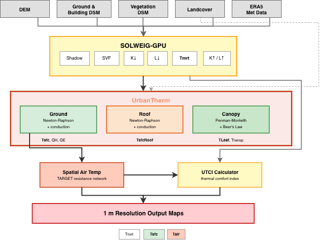
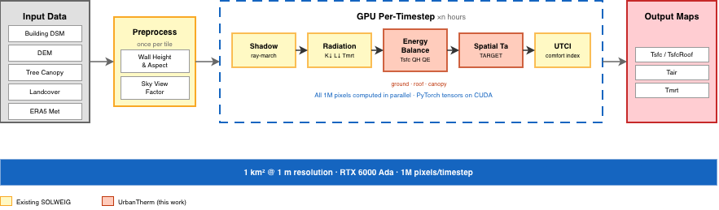

Cities are getting hotter. Urban surfaces  - asphalt, concrete, rooftops  - absorb solar radiation and re-emit it as heat, creating the urban heat island (UHI) effect. Understanding *where* and *how much* hotter at fine spatial resolution is critical for urban planning, public health, and climate adaptation. But existing tools either lack the physics or can't scale.

This post describes **UrbanTherm**, an energy balance extension to the SOLWEIG radiation model that computes physics-based surface temperatures, air temperatures, and thermal comfort at **1-meter resolution** using GPU acceleration.

---

## The Problem with Parametric Surface Temperatures

SOLWEIG (Solar and Longwave Environmental Irradiance Geometry) is a well-established model for computing Mean Radiant Temperature ($T_\mathrm{mrt}$) in urban environments. It uses digital surface models (DSMs) to compute shadow patterns, sky view factors, and shortwave/longwave radiation fluxes at each pixel.

However, standard SOLWEIG estimates ground surface temperature using a **parametric sinusoidal fit**:

$$T_g = T_{gK} \cdot h_\mathrm{max} \cdot \sin\!\left(\frac{t - t_\mathrm{sunrise}}{t_\mathrm{LST,max} - t_\mathrm{sunrise}} \cdot \frac{\pi}{2}\right) \cdot CI$$

where $T_{gK}$ is a fitted coefficient, $h_\mathrm{max}$ is maximum solar altitude, and $CI$ is a clearness index. This is fast but physically naive  - it can't distinguish asphalt from grass, doesn't account for subsurface heat storage, and ignores evapotranspiration.

## Our Approach: Full Surface Energy Balance

UrbanTherm replaces the parametric model with a **full surface energy balance** solved at every pixel:

$$R_\mathrm{net} = Q_H + Q_G + Q_E$$

Expanding each term:

$$(1-\alpha)K_\downarrow + \varepsilon L_\downarrow - \varepsilon\sigma T_\mathrm{sfc}^4 = h_c(T_\mathrm{sfc} - T_a) + \frac{\lambda}{d}(T_\mathrm{sfc} - T_{\mathrm{layer},1}) + \frac{\rho c_p (e_s(T_\mathrm{sfc}) - e_a)}{\gamma(r_a + r_s)}$$

where:
- $R_\mathrm{net}$ = net radiation (shortwave absorbed + longwave in − longwave out)
- $Q_H$ = sensible heat flux (surface heating the air via convection)
- $Q_G$ = ground heat flux (heat conducted into the subsurface)
- $Q_E$ = latent heat flux (evapotranspiration from pervious surfaces)

This is nonlinear  - radiative emission scales as $T^4$, and latent heat depends on the exponential saturation vapor pressure curve. We solve for $T_\mathrm{sfc}$ using **Newton-Raphson iteration** with the Jacobian:

$$F'(T) = 4\varepsilon\sigma T^3 + h_c + \lambda/d + \frac{\rho c_p}{\gamma(r_a + r_s)} \cdot \frac{de_s}{dT}$$

Convergence is typically reached in 3-4 iterations to within 0.001 K.

---

## Three Energy Balance Domains

UrbanTherm solves separate energy balances for three surface types:

### Ground Surfaces

Each pixel is assigned a material based on a landcover grid  - asphalt, concrete, grass, soil, or water  - each with distinct thermal conductivity, heat capacity, albedo, emissivity, and stomatal conductance. Subsurface heat conduction is solved using a **4-layer implicit scheme** (Thomas algorithm) with layer thicknesses of 0.02, 0.05, 0.10, and 0.20 m.

For pervious surfaces (grass, soil), evapotranspiration is modeled using a **Jarvis-Stewart stomatal conductance** model:

$$g_s = g_\mathrm{max} \cdot f_\mathrm{rad}(K_\downarrow) \cdot f_\mathrm{vpd}(\mathrm{VPD}) \cdot f_\mathrm{temp}(T_a)$$

where stress functions reduce conductance under low light, high vapor pressure deficit, and non-optimal temperatures.

### Rooftops

Standard SOLWEIG treats buildings as opaque  - no surface temperature at building pixels. We added a **roof energy balance** with multi-layer conduction through realistic roof assemblies (membrane → concrete → XPS insulation → gypsum). Green roofs get their own assembly with a soil substrate and drainage layer, plus active evapotranspiration.

### Tree Canopies

A **big-leaf Penman-Monteith model** computes leaf temperature and transpiration for vegetated pixels. Since leaves have negligible thermal mass, $Q_G = 0$ and the balance simplifies to:

$$R_\mathrm{net} = Q_H + Q_E$$

Radiation interception uses Beer's Law ($\tau = e^{-k \cdot \mathrm{LAI}}$), and stomatal conductance uses canopy-specific Jarvis-Stewart parameters for deciduous vs. evergreen trees.

---

## Spatial Air Temperature

Standard SOLWEIG assumes uniform air temperature across the domain. In reality, a sunlit asphalt parking lot heats the air above it more than an adjacent park. We implemented spatially varying air temperature using the **TARGET resistance network model**, which computes a local air temperature perturbation based on the sensible heat flux from surrounding surfaces:

- Canyon geometry (height-to-width ratio from SVF)
- Wind attenuation within street canyons
- Stability-corrected turbulent exchange
- Gaussian smoothing ($\sigma \approx 10$ m) to represent horizontal mixing

This produces realistic intra-urban air temperature variation of $\pm$0.5-1.0°C at 1-meter resolution.

---

## GPU Acceleration with PyTorch

The entire energy balance  - Newton-Raphson solver, Thomas algorithm conduction, Jarvis-Stewart conductance, TARGET air temperature  - is implemented in **PyTorch** and runs on GPU. Every pixel is computed in parallel.

For a 1 km$^2$ domain at 1 m resolution, that's **1 million pixels per timestep**, all processed simultaneously on an RTX 6000 Ada. The key design decisions:

- **Fixed 5 Newton-Raphson iterations** (no branching/early exit, better for GPU)
- **Tensor-based Thomas algorithm** solving the tridiagonal system across all pixels at once
- **Material property lookup** via integer index arrays  - no per-pixel branching
- **Conduction sub-stepping** when the Fourier number exceeds 0.5 (thin roof layers at hourly timesteps)

### Operator-Splitting Stability

One subtle issue: the Newton-Raphson solver and conduction solver are operator-split. For thin surface layers where the thermal coupling time constant $\tau \ll \Delta t$, the layer fully equilibrates within one timestep, causing the NR solver to overshoot. We introduced a **ground heat flux coupling factor**:

$$\beta = \frac{\tau}{\Delta t}\left(1 - e^{-\Delta t/\tau}\right)$$

This reduced hour-to-hour $Q_H$ oscillations on roof pixels by 69% in our Chicago test case.

---

## Material Properties

Each surface type is characterized by thermal and radiative properties:

| Material | Albedo | Emissivity | $\lambda$ (W/m/K) | $C$ (MJ/m$^3$/K) | Evaporation |
|---|---|---|---|---|---|
| Asphalt | 0.12 | 0.95 | 0.75 | 1.9 | No |
| Concrete | 0.25 | 0.92 | 1.4 | 2.0 | No |
| Grass | 0.25 | 0.95 | 0.25 | 1.0 | Yes |
| Soil (dry) | 0.25 | 0.94 | 0.35 | 1.3 | Yes |
| Water | 0.08 | 0.98 | 0.6 | 4.18 | Free |

Roofs use a 4-layer assembly: waterproofing membrane (0.01 m), concrete slab (0.05 m), XPS insulation (0.10 m), and gypsum ceiling (0.016 m). Green roofs add a soil substrate and drainage layer with active evapotranspiration  - notably, we explicitly model the drainage layer, which standard green roof energy balance models (EnergyPlus EcoRoof, WUFI) omit.

---

## What UrbanTherm Produces

For each timestep and each 1 m pixel:

- **Surface temperature** ($T_\mathrm{sfc}$)  - ground, roof, and canopy
- **Spatially varying air temperature** ($T_\mathrm{air}$)
- **Mean radiant temperature** ($T_\mathrm{mrt}$)
- **UTCI** (Universal Thermal Climate Index)  - a thermal comfort metric
- Component fluxes: $Q_H$, $Q_E$, $Q_G$, $R_\mathrm{net}$

This enables questions like: *How much cooler would this street be with trees? What if we replaced this parking lot with a park? How effective are green roofs at reducing surface temperatures?*

---

## References

- Lindberg et al. (2008), "SOLWEIG 1.0  - Modelling spatial variations of 3D radiant fluxes and mean radiant temperature in complex urban settings"
- Nice et al. (2018), "Development of the VTUF-3D v1.0 urban micro-climate model"
- Broadbent et al. (2019), "The Air-temperature Response to Green/blue-infrastructure (TARGET) framework"
- Mascart et al. (1995), "A modified parameterization of flux-profile relationships in the surface layer"
- Jarvis (1976), "The interpretation of the variations in leaf water potential and stomatal conductance"
- Sailor (2008), "A green roof model for building energy simulation programs"
